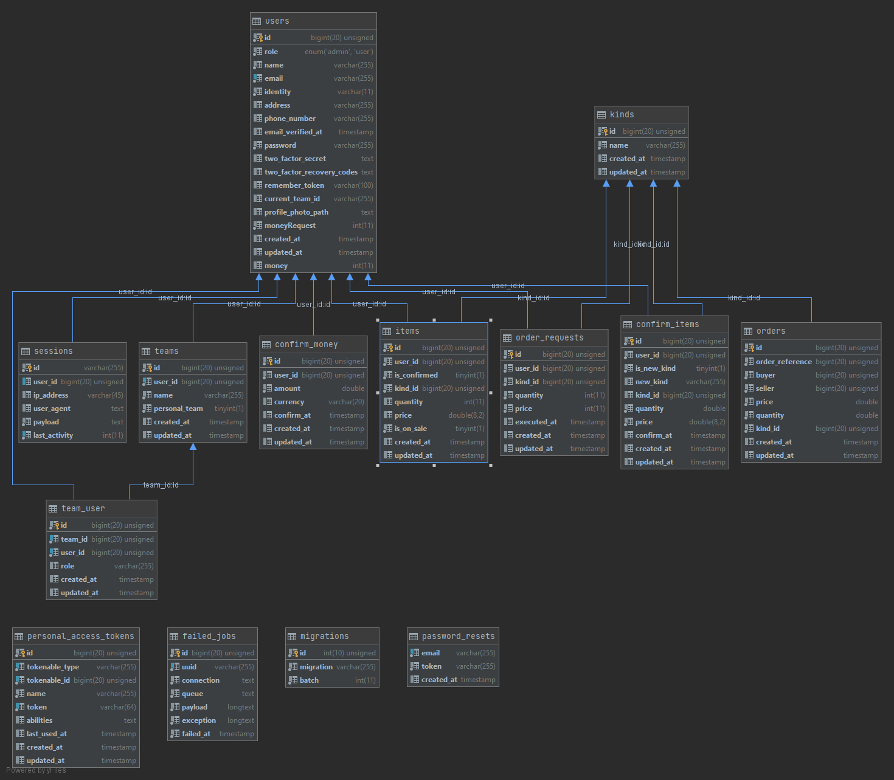

<h1>HAAL v1.1 - Yazılım Yapımı 20/21 Final</h1>

<h2>Emircan ÇETİN</h2>

Celal Bayar Üniversitesi Yazılım Mühendisliği

<h3>Yazılım Yapımı Dersi Final Ödevi</h3>

<h2>Videolar</h2>
<a href="https://youtu.be/81m2n0L-Yu0">v1.0</a> 
<a href="https://youtu.be/H2EBV3GvPoM">v1.1</a>

<h4>Kurulum</h4>
<ol>
<li>Öncelikle apache ve mysql server gereklidir.</li>
<li>haal adında bir veritabanı oluşturun.</li>
<li>.env dosyasında veritabanı ayarlarınızı doğrulayın.</li>
<li>Proje dosyalarını apache serverda haal adında bir klasöre kopyalayın.</li>
<li>haal klasöründe komut istemcisini çalıştırın (composer kurulu olmalıdır.)</li>
<li><code>php artisan migrate</code> komutunu çalıştırın</li>
<li>Projenin ana yolu şudur: "localhost/haal/public". Ancak virtualhost oluşturarak kolaylık sağlayabilirsiniz.</li>
</ol>

<h4>Kullanılan Teknoloji ve Paketler</h4>
<ul>
<li>Laravel v.8</li>
<li>Jetstream</li>
<li>miten5/larawind</li>
<li>Liveware</li>
<li>Fortify</li>
<li>Blade</li>
<li>TailwindCss</li>
<li>Jquery</li>
<li>Excell</li>
<li>AlertifyJs</li>
<li>Carbon</li>
</ul>

<h4>Veritabanı Diagramı</h4>

<h4>Ekran Görüntüleri</h4>

## License

The Laravel framework is open-sourced software licensed under the [MIT license](https://opensource.org/licenses/MIT).
